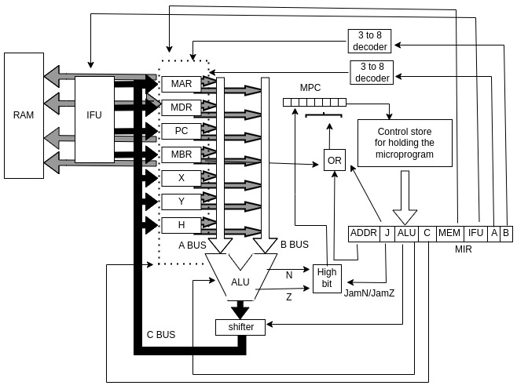

# Assembly-interpreter

This is a 32 bit computer architecture simulator that compiles and run a assembly codes defined by the architecture.

## Purpose

The intention of the project is to understand how modern computers work.

It's possible to define new microinstructions for the computer following the model in [examples/firmware3.hpp](examples/firmware3.hpp), save the microinstruction address in [src/assembler/consts.hpp](src/assembler/consts.hpp), add them to the array of instructions, and set them into the set_ops(string& line, unsigned long int &oper) function found in [src/assembler/assembler.cpp](src/assembler/assembler.cpp).

## Microarchitecture

The model of the microarchitecture is basead on the book "Structured Computer Organization" by author [Andrew S.Tanenbaum](https://en.wikipedia.org/wiki/Andrew_S._Tanenbaum). The [instruction set](https://simple.wikipedia.org/wiki/Instruction_set#:~:text=An%20instruction%20set%20is%20the,share%20a%20common%20instruction%20set.) can be found in [examples/firmware3](fff).

Here is an ilustration of the micrcoarchitecture in a diagram.

## Usage

### Prerequisites

- GNU C++ Compiler ( g++ )
- GNU Make installed

On debian-based linux distributions, run `sudo apt install make g++
`
### How to run?

1. Clone the repository:
    `git clone https://github.com/WandersonSoares00/Assembly-interpreter`

2. Change the directory:
    `cd Assembly-interpreter`

3. Compile the project:
    `make all`

4. Generate a binary of an .asm program with the assembler
    take program [questions/fat.asm](questions/fat.asm) as an example, run the following command:
    `./assembler questions/fat.asm outBin`

5. Copy the binary in memory and run a computer:    `./comp outBin`

    For default, the computer print the word 1 and 2 of memory in the scream to simulate the [standard output](https://en.wikipedia.org/wiki/Standard_streams)

## Licence information
This project is licensed under the GNU General Public License v3.0.
